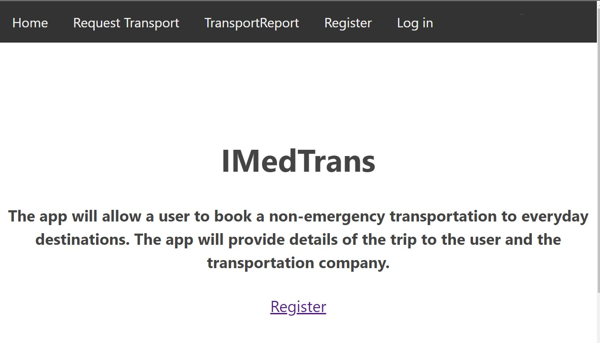

# Protech-app

This project was bootstrapped with [Create React App](https://github.com/facebook/create-react-app).

## Live app

[Try it out](https://im-ed-trans-app-dadetifa1.vercel.app).

## Github api server repo

[IMedTrans-api](https://github.com/dadetifa1/ImedTrans-api).

## summary

A user can use this application to submit a request for a non-emergency transportation

## Screen Shots

Landing Page:

Requesting transportation:

## Tech used

NodeJS - Express - ReactJS - HTML - CSS - Git - Relationship DB
